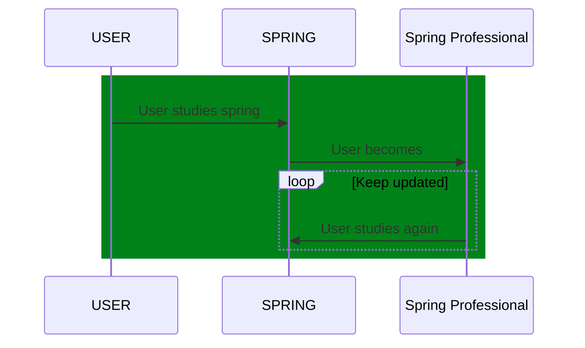

# Spring-test-drives

[](https://twitter.com/intent/tweet?text=%20Checkout%20this%20%40github%20repo%20by%20%40joaofse%20%F0%9F%91%A8%F0%9F%8F%BD%E2%80%8D%F0%9F%92%BB%3A%20https%3A//github.com/jesperancinha/jeorg-spring-5-test-drives)
[](https://github.com/jesperancinha/jeorg-spring-5-test-drives)
[](#)

[](https://circleci.com/gh/jesperancinha/jeorg-spring-5-test-drives)
[](https://travis-ci.com/jesperancinha/jeorg-spring-5-test-drives)
[](https://ci.appveyor.com/project/jesperancinha/jeorg-spring-5-test-drives)

[](https://www.codacy.com/gh/jesperancinha/jeorg-spring-5-test-drives/dashboard?utm_source=github.com&amp;utm_medium=referral&amp;utm_content=jesperancinha/jeorg-spring-5-test-drives&amp;utm_campaign=Badge_Grade)
[](https://codebeat.co/projects/github-com-jesperancinha-jeorg-spring-5-test-drives-master)
[](https://bettercodehub.com/results/jesperancinha/jeorg-spring-5-test-drives)
[](https://snyk.io/test/github/jesperancinha/jeorg-spring-5-test-drives)

[](https://www.codacy.com/gh/jesperancinha/jeorg-spring-5-test-drives/dashboard?utm_source=github.com&utm_medium=referral&utm_content=jesperancinha/jeorg-spring-5-test-drives&utm_campaign=Badge_Coverage)
[](https://coveralls.io/github/jesperancinha/jeorg-spring-5-test-drives?branch=master)
[](https://codecov.io/gh/jesperancinha/jeorg-spring-5-test-drives)

[](#)
[](#)
[](#)

---
[](https://www.oracle.com/nl/java/)
[](https://projectlombok.org/)
[](https://spring.io/projects/spring-framework)
[](https://spring.io/projects/spring-boot)
[](https://spring.io/projects/spring-boot)
[](https://spring.io/reactive)

## Description

SPRING study project.

The purpose of this project is to keep up with the development of the Spring Framework

## Contents

1.  [Spring 5](./jeorg-spring-5) - Test drives for the Spring 5 Frawework (Bare minimum focus given to Spring Boot)
2.  [Spring Kotlin 5](./jeorg-spring-kotlin-5) - Test drives for the Spring 5 Frawework in Kotlin (Bare minimum focus given to Spring Boot)

VERY IMPORTANT NOTE: It is important to take note that none of the examples presented are thought to become production versions of any sort of product.   
The goal of this project is purely to demonstrate and provide examples of different Aspects of the Spring Framework.  
Concepts related to immutability/mutability, SOLID, ACID, 12 Factor App, Reactive Manifesto and others are present, but they are not followed in every single example module.   
The reason being is that they take time, and adding these concerns per module can potentially lead away from the specific goal of each module.   
These modules dot not pertain to show good practices, code styles or javadocs necessarily.    
When it comes to using Lombok, you'll find its usage more often, but it won't be used everywhere given that in some cases it may hide some important concepts.    
These three remain a concern, but they are not the focus of this repo.   
It is also true that I will do my best to improve every single module as part of my Spring Framework journey, so these concepts will show up more often.   
What's important to take away from this repo it to understand how the Spring Framework works.   
If you understand all of this, then please continue with your studies. Thank you! 🙏

João Esperancinha, 2021/04/21

## Build

Note that if you want to build this project from the root, you need to use one of the JDK 11 or upper versions.

<i>
See [Hints&Tricks](https://github.com/jesperancinha/project-signer/blob/master/project-signer-templates/Hints%26Tricks.md)
document for more details</i>

Running on Travis.

```bash
mvn clean install -Dconsolerizer.show=false
```

## Install JDK 11 using [SDK-MAN](https://sdkman.io/)

```bash
sdk install java 11.0.9.hs-adpt
sdk use java 11.0.9.hs-adpt
```

## Run Codecov

```bash
mvn clean test -Dconsolerizer.show=false
bash <(curl -s https://codecov.io/bash)
```
## Sequence Diagram



<i>Note: You need a Mermaid plugin extension</i>
i.e. [mermaid-plugin](https://chrome.google.com/webstore/detail/mermaid-diagrams/phfcghedmopjadpojhmmaffjmfiakfil/related)

## References

### Books

-   Cosmina, I. (11th December 2019). <i>Pivotal Certified Professional Core Spring 5 Developer Exam: A Study Guide Using Spring Framework 5</i>. (Second Edition). Apress
-   Sharma, R. (September 2018). <i>Hands-On Reactive Programming with Reactor</i>. (First Edition). Packt
-   Cosmina, I. Harrop, R. Schaefer, C. Ho, C. (October 2017). <i>Pro Spring 5 An In-Depth Guide to the Spring Framework and Its Tools</i>. (Fifth Edition). Apress
-   Winch, R. Mularien, P. (December 2012). <i>Spring Security 3.1</i>. (Second Edition). Packt Publishing
-   Kurniawan, B. Deck, P. (January 2015). <i>Servlet, JSP & Spring MVC</i>. (First Edition). Brainy Software
-   Long, J. (2020). <i>Reactive Spring</i>. (First Edition). Josh Long

### Online

-   [What’s new in Spring Framework 5](https://developer.ibm.com/languages/java/tutorials/j-whats-new-in-spring-framework-5-theedom)
-   [Spring Framework Overview](https://docs.spring.io/spring-framework/docs/5.1.18.RELEASE/spring-framework-reference/overview.html)
-   [Spring Framework Documentation - Current Version](https://docs.spring.io/spring-framework/docs/current/reference/html/index.html)

## About me 👨🏽‍💻🚀🏳️‍🌈

[](http://joaofilipesabinoesperancinha.nl)
[](https://medium.com/@jofisaes)
[](https://www.credly.com/users/joao-esperancinha)
[](https://joaofilipesabinoesperancinha.nl/)
[](https://github.com/jesperancinha)
[](https://twitter.com/joaofse)
[](https://github.com/JEsperancinhaOrg)   
[](https://github.com/jesperancinha/project-signer/blob/master/project-signer-templates/Articles.md)
[](http://itf.joaofilipesabinoesperancinha.nl/)
[](https://joaofilipesabinoesperancinha.nl/badges)
[](https://github.com/jesperancinha/project-signer/blob/master/project-signer-templates/Status.md)
[](https://www.coursera.org/user/da3ff90299fa9297e283ee8e65364ffb)
[](https://play.google.com/store/apps/developer?id=Joao+Filipe+Sabino+Esperancinha)   
[](https://search.maven.org/search?q=org.jesperancinha)
[](https://hub.docker.com/u/jesperancinha)
[](https://stackoverflow.com/users/3702839/joao-esperancinha)
[](https://www.reddit.com/user/jesperancinha/)
[](https://dev.to/jofisaes)
[](https://hackernoon.com/@jesperancinha)
[](https://www.codeproject.com/Members/jesperancinha)
[](https://github.com/jesperancinha)
[](https://bitbucket.org/jesperancinha)
[](https://gitlab.com/jesperancinha)
[](https://bintray.com/jesperancinha)
[](https://www.freecodecamp.org/jofisaes)
[](https://www.hackerrank.com/jofisaes)
[](https://codeforces.com/profile/jesperancinha)
[](https://coderbyte.com/profile/jesperancinha)
[](https://www.codewars.com/users/jesperancinha)
[](https://codepen.io/jesperancinha)
[](https://news.ycombinator.com/user?id=jesperancinha)
[](https://www.infoq.com/profile/Joao-Esperancinha.2/)
[](https://www.linkedin.com/in/joaoesperancinha/)
[](https://www.xing.com/profile/Joao_Esperancinha/cv)
[](https://jofisaes.tumblr.com/)
[](https://nl.pinterest.com/jesperancinha/)
[](https://nl.quora.com/profile/Jo%C3%A3o-Esperancinha)

## Achievements

[](https://www.credly.com/badges/27a14e06-f591-4105-91ca-8c3215ef39a2)
[](https://www.credly.com/badges/87609d8e-27c5-45c9-9e42-60a5e9283280)
[](https://www.credly.com/badges/92e036f5-4e11-4cff-9935-3e62266d2074)
[](https://www.credly.com/badges/a206436d-6fd8-4ca1-8feb-38a838446ee7)
[](https://www.credly.com/badges/f4c6cc1e-cb52-432b-904d-36d266112225)
[](https://www.credly.com/badges/6db92c1e-7bca-4856-9543-0d5ed0182794)
