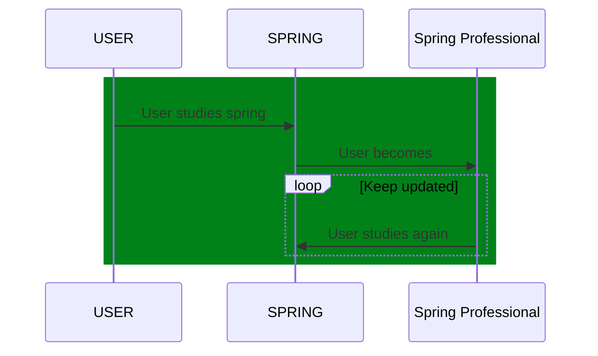

# Spring Test Drives

---

[](https://twitter.com/intent/tweet?text=%20Checkout%20this%20%40github%20repo%20by%20%40joaofse%20%F0%9F%91%A8%F0%9F%8F%BD%E2%80%8D%F0%9F%92%BB%3A%20https%3A//github.com/jesperancinha/jeorg-spring-test-drives)
[](https://github.com/jesperancinha/jeorg-spring-test-drives)
[](https://www.apache.org/licenses/LICENSE-2.0)

[](https://circleci.com/gh/jesperancinha/jeorg-spring-test-drives)
[](https://ci.appveyor.com/project/jesperancinha/jeorg-spring-test-drives)
[](https://github.com/jesperancinha/jeorg-spring-test-drives/actions/workflows/jeorg-spring-test-drives.yml)

[](https://www.codacy.com/gh/jesperancinha/jeorg-spring-test-drives/dashboard?utm_source=github.com&amp;utm_medium=referral&amp;utm_content=jesperancinha/jeorg-spring-test-drives&amp;utm_campaign=Badge_Grade)
[](https://codebeat.co/projects/github-com-jesperancinha-jeorg-spring-test-drives-master)
[](https://snyk.io/test/github/jesperancinha/jeorg-spring-test-drives)

[](https://www.codacy.com/gh/jesperancinha/jeorg-spring-test-drives/dashboard?utm_source=github.com&utm_medium=referral&utm_content=jesperancinha/jeorg-spring-test-drives&utm_campaign=Badge_Coverage)
[](https://coveralls.io/github/jesperancinha/jeorg-spring-test-drives?branch=master)
[](https://codecov.io/gh/jesperancinha/jeorg-spring-test-drives)

[](#)
[](#)
[](#)

## Technologies used

---

[](https://www.oracle.com/nl/java/)
[](https://projectlombok.org/)
[](https://kotlinlang.org/)
[](https://spring.io/projects/spring-framework)
[](https://spring.io/projects/spring-boot)
[](https://spring.io/projects/spring-boot)
[](https://spring.io/reactive)
[](https://www.eclipse.org/jetty/)
[](https://kotest.io/)
[](https://mockk.io/)
[](https://junit.org/junit5/docs/current/user-guide/)
[](https://site.mockito.org/)
[](https://assertj.github.io/doc/)
[](https://www.docker.com/)
[](https://docs.docker.com/compose/)
[](https://www.testcontainers.org/)
[](https://www.h2database.com/)
[](https://www.postgresql.org/)
[](http://cassandra.apache.org/)

---

## Description

SPRING study project.

The purpose of this project is to keep up with the development of the Spring Framework

See [Log Book](./LogBook.md) for further details.

#### Stable releases

-   [0.0.0](https://github.com/jesperancinha/jeorg-spring-test-drives/tree/0.0.0) - [d8700ab7d597fb825cbfc1fca30c2153ef5141ea](https://github.com/jesperancinha/jeorg-spring-test-drives/tree/0.0.0) - Spring boot 2.7.0 / JDK 11
-   [1.0.0](https://github.com/jesperancinha/jeorg-spring-test-drives/tree/1.0.0) - [395d79e218595e57365c7ad9723c2aa20ad77881](https://github.com/jesperancinha/jeorg-spring-test-drives/tree/1.0.0) - Spring boot 2.7.5 / JDK 17
-   [2.0.0](https://github.com/jesperancinha/jeorg-spring-test-drives/tree/2.0.0) - [179ec86df1033b9d551621173751bd60590da775](https://github.com/jesperancinha/jeorg-spring-test-drives/tree/2.0.0) - Spring boot 3.0.0 / JDK 17
-   [3.0.0](https://github.com/jesperancinha/jeorg-spring-test-drives/tree/3.0.0) - [49d0d3863ff7079c473b2a8bfe285c7735a71f9c](https://github.com/jesperancinha/jeorg-spring-test-drives/tree/3.0.0) - Spring boot 3.0.2 / JDK 19

## Contents

1.  [Spring](./jeorg-spring-5) - Test drives for the Spring 5 Frawework (Bare minimum focus given to Spring Boot)
2.  [Spring Kotlin](./jeorg-spring-kotlin-5) - Test drives for the Spring 5 Frawework in Kotlin (Bare minimum focus given to Spring Boot)

## Specs

1.  Spring: [org.springframework](https://mvnrepository.com/artifact/org.springframework/) - 5.2.15.RELEASE
2.  Spring Boot: [org.springframework.boot/spring-boot-starter-parent](https://mvnrepository.com/artifact/org.springframework.boot/spring-boot-starter-parent) - 2.3.11.RELEASE

## Build

Note that if you want to build this project from the root, you need to use one of the JDK 11 or upper versions.

<i>See [Hints&Tricks](https://github.com/jesperancinha/project-signer/blob/master/project-signer-templates/Hints%26Tricks.md)
document for more details</i>
```bash
mvn clean install -Dconsolerizer.show=false
```

## Install JDK using [SDK-MAN](https://sdkman.io/)

```bash
. ./sdk19.sh
```

## Detect Non-Running Tests

```bash
mvn clean install | egrep "Tests run|----"
```
## Sequence Diagram



<i>Note: You need a Mermaid plugin extension</i>

i.e. [mermaid-plugin](https://chrome.google.com/webstore/detail/mermaid-diagrams/phfcghedmopjadpojhmmaffjmfiakfil/related)

## Tech-stack Cloud

`@Transational timeout`, `TestRestTemplate`, `HealthIndicator`, `actuator`, `Embedded`, `JPA`, `Big Data`

## Running unit and integration tests

The examples presented in this repo need to use a docker-engine/docker-machine in order to run.

This is because they make use of the [testcontainers](https://www.testcontainers.org/) project.

I tested this using Docker Desktop for mac and on an ubuntu-unity machine. As long as the docker-machine/docker-engine is running, the maven build shoud also work.

Using embedded alternatives revealed to be quite cumbersome, inefficient and slow.

For more info on docker desktop please check their [website](https://www.docker.com/).

For learning how to install docker in ubuntu please check their [website](https://docs.docker.com/engine/install/ubuntu/).

When this is ready, just run:

```shell
make build
```

or

```shell
mvn clean install
```

## References

### Online

-   [How to test the REST Clients of your Spring Boot Application with @RestClientTest](https://jschmitz.dev/posts/how_to_test_the_rest_clients_of_your_spring_boot_application_with_restclienttest/)

### Books

-   Cosmina, I. (11th December 2019). <i>Pivotal Certified Professional Core Spring 5 Developer Exam: A Study Guide Using Spring Framework 5</i>. (Second Edition). Apress
-   Sharma, R. (September 2018). <i>Hands-On Reactive Programming with Reactor</i>. (First Edition). Packt
-   Cosmina, I. Harrop, R. Schaefer, C. Ho, C. (October 2017). <i>Pro Spring 5 An In-Depth Guide to the Spring Framework and Its Tools</i>. (Fifth Edition). Apress
-   Winch, R. Mularien, P. (December 2012). <i>Spring Security 3.1</i>. (Second Edition). Packt Publishing
-   Kurniawan, B. Deck, P. (January 2015). <i>Servlet, JSP & Spring MVC</i>. (First Edition). Brainy Software
-   Long, J. (2020). <i>Reactive Spring</i>. (First Edition). Josh Long

### Online

-   [What’s new in Spring Framework 5](https://developer.ibm.com/languages/java/tutorials/j-whats-new-in-spring-framework-5-theedom)
-   [Spring Framework Overview](https://docs.spring.io/spring-framework/docs/5.1.18.RELEASE/spring-framework-reference/overview.html)
-   [Spring Framework Documentation - Current Version](https://docs.spring.io/spring-framework/docs/current/reference/html/index.html)

## About me

[](http://joaofilipesabinoesperancinha.nl)
[](https://www.youtube.com/@joaoesperancinha)
[](https://medium.com/@jofisaes)
[](https://www.buymeacoffee.com/jesperancinha)
[](https://twitter.com/joaofse)
[](https://masto.ai/@jesperancinha)
[](https://sessionize.com/joao-esperancinha)
[](https://www.instagram.com/joaofisaes)
[](https://jofisaes.tumblr.com)
[](https://open.spotify.com/user/jlnozkcomrxgsaip7yvffpqqm)
[](https://www.linkedin.com/in/joaoesperancinha/)
[](https://www.xing.com/profile/Joao_Esperancinha/cv)
[](https://news.ycombinator.com/user?id=jesperancinha)
[](https://github.com/jesperancinha)
[](https://bitbucket.org/jesperancinha)
[](https://gitlab.com/jesperancinha)
[](https://stackoverflow.com/users/3702839/joao-esperancinha)
[](https://www.credly.com/users/joao-esperancinha)
[](https://www.coursera.org/user/da3ff90299fa9297e283ee8e65364ffb)
[](https://hub.docker.com/u/jesperancinha)
[](https://www.reddit.com/user/jesperancinha/)
[](https://hackernoon.com/@jesperancinha)
[](https://www.codeproject.com/Members/jesperancinha)
[](https://www.freecodecamp.org/jofisaes)
[](https://www.hackerrank.com/jofisaes)
[](https://leetcode.com/jofisaes)
[](https://www.codewars.com/users/jesperancinha)
[](https://codepen.io/jesperancinha)
[](https://www.hackerearth.com/@jofisaes)
[](https://www.khanacademy.org/profile/jofisaes)
[](https://nl.pinterest.com/jesperancinha)
[](https://nl.quora.com/profile/Jo%C3%A3o-Esperancinha)
[](https://play.google.com/store/apps/developer?id=Joao+Filipe+Sabino+Esperancinha)
| [Sonatype Search Repos](https://search.maven.org/search?q=org.jesperancinha)
| [Dev.TO](https://dev.to/jofisaes)
| [Codebyte](https://coderbyte.com/profile/jesperancinha)
| [InfoQ](https://www.infoq.com/profile/Joao-Esperancinha.2/)
| [VMware Spring Professional 2021](https://www.credly.com/badges/762fa7a4-9cf4-417d-bd29-7e072d74cdb7)
| [Oracle Certified Professional, Java SE 11 Programmer](https://www.credly.com/badges/87609d8e-27c5-45c9-9e42-60a5e9283280)
| [Oracle Certified Professional, JEE7 Developer](https://www.credly.com/badges/27a14e06-f591-4105-91ca-8c3215ef39a2)
| [IBM Cybersecurity Analyst Professional](https://www.credly.com/badges/ad1f4abe-3dfa-4a8c-b3c7-bae4669ad8ce)
| [Certified Advanced JavaScript Developer](https://cancanit.com/certified/1462/)
| [Certified Neo4j Professional](https://graphacademy.neo4j.com/certificates/c279afd7c3988bd727f8b3acb44b87f7504f940aac952495ff827dbfcac024fb.pdf)
| [Deep Learning](https://www.credly.com/badges/8d27e38c-869d-4815-8df3-13762c642d64)
| [](https://github.com/JEsperancinhaOrg)
[](https://joaofilipesabinoesperancinha.nl/badges)
[](https://github.com/jesperancinha/project-signer/blob/master/project-signer-quality/Build.md)
