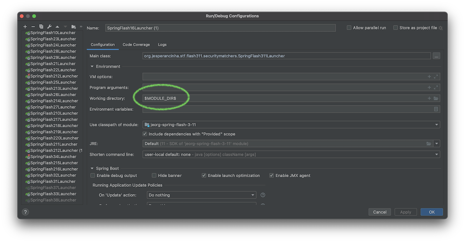

# spring-5 - Spring 5

[](https://twitter.com/intent/tweet?text=%20Checkout%20this%20%40github%20repo%20by%20%40joaofse%20%F0%9F%91%A8%F0%9F%8F%BD%E2%80%8D%F0%9F%92%BB%3A%20https%3A//github.com/jesperancinha/spring-test-drives)
[](https://github.com/jesperancinha/spring-test-drives)
[](#)

[](https://www.codacy.com/manual/jofisaes/spring-test-drives?utm_source=github.com&amp;utm_medium=referral&amp;utm_content=jesperancinha/spring-test-drives&amp;utm_campaign=Badge_Grade)
[](https://codebeat.co/projects/github-com-jesperancinha-spring-test-drives-master)
[](https://circleci.com/gh/jesperancinha/spring-test-drives)
[](https://travis-ci.org/jesperancinha/spring-test-drives)
[](https://bettercodehub.com/)
[](https://ci.appveyor.com/project/jesperancinha/spring-test-drives)
[](https://snyk.io/test/github/jesperancinha/spring-test-drives)

[](#)
[](#)
[](#)

---
[](https://www.oracle.com/nl/java/)
[](https://projectlombok.org/)
[](https://spring.io/projects/spring-framework)
[](https://spring.io/projects/spring-boot)
[](https://spring.io/projects/spring-boot)
[](https://spring.io/reactive)

## Description

SPRING 5 study project.

This project is intended as a study tool for Spring version 5.

I'm using JDK version 11.0.9.hs-adpt for all of these tests.

```bash
sdk install java 11.0.9.hs-adpt
sdk use 11.0.9.hs-adpt 
```

Many of the modules are using JSP's.
For this you need to have your running path right.
If you run spring boot from the command line, you should not see any issue:

```bash
mvn clean install spring-boot:run
```

On the other hand, if running through an IDE, the root path must be specified.
In IntelliJ as an example:



## Contents:

1. [jeorg-spring-app-old](./jeorg-spring-app-old) - 💾 Old applications present when this project started
2. [jeorg-spring-topics](./jeorg-spring-topics) - 🗄 A set of Spring Boot applications exploring each relevant Spring topic per application
3. [jeorg-spring-flash](./jeorg-spring-flash) - ⚡️ Fast track modules about Spring Boot 5
   1. [jeorg-spring-flash-set-1](./jeorg-spring-flash/jeorg-spring-flash-set-1) - ⚡️ Fast track modules about Spring Boot 5 - Set 1 with 20 modules
       1. [jeorg-spring-flash-1](./jeorg-spring-flash/jeorg-spring-flash-set-1/jeorg-spring-flash-1) - 🍋 PropertyEditorRegistrar and converters
       2. [jeorg-spring-flash-2](./jeorg-spring-flash/jeorg-spring-flash-set-1/jeorg-spring-flash-2) - 🌱 AOP (Aspect Oriented Programming)
       3. [jeorg-spring-flash-3](./jeorg-spring-flash/jeorg-spring-flash-set-1/jeorg-spring-flash-3) - ⛴ JDBC with boats
       4. [jeorg-spring-flash-4](./jeorg-spring-flash/jeorg-spring-flash-set-1/jeorg-spring-flash-4) - 🪄 Spring param converters
       5. [jeorg-spring-flash-5](./jeorg-spring-flash/jeorg-spring-flash-set-1/jeorg-spring-flash-5) - 🥔 Sequence generator with potatoes
       6. [jeorg-spring-flash-6](./jeorg-spring-flash/jeorg-spring-flash-set-1/jeorg-spring-flash-6) - 🧮 Keep the math in the Session
       7. [jeorg-spring-flash-7](./jeorg-spring-flash/jeorg-spring-flash-set-1/jeorg-spring-flash-7) - 🏎 🌺 Exception handling with cars and flowers
       8. [jeorg-spring-flash-8](./jeorg-spring-flash/jeorg-spring-flash-set-1/jeorg-spring-flash-8) - 🎄 Xmas message with simple JSP in Spring
       9. [jeorg-spring-flash-9](./jeorg-spring-flash/jeorg-spring-flash-set-1/jeorg-spring-flash-9) - 🤖 A very simple bot with SockJS support
       10. [jeorg-spring-flash-10](./jeorg-spring-flash/jeorg-spring-flash-set-1/jeorg-spring-flash-10) - 🛑 Error messages
       11. [jeorg-spring-flash-11](./jeorg-spring-flash/jeorg-spring-flash-set-1/jeorg-spring-flash-11) - 👔 Form parameters
       12. [jeorg-spring-flash-12](./jeorg-spring-flash/jeorg-spring-flash-set-1/jeorg-spring-flash-12) - 🔑 CORS explained via annotations
       13. [jeorg-spring-flash-13](./jeorg-spring-flash/jeorg-spring-flash-set-1/jeorg-spring-flash-13) - 🗄 GZipping Static Resources
       14. [jeorg-spring-flash-14](./jeorg-spring-flash/jeorg-spring-flash-set-1/jeorg-spring-flash-14) - 🏠 Health Indicators
       15. [jeorg-spring-flash-15](./jeorg-spring-flash/jeorg-spring-flash-set-1/jeorg-spring-flash-15) - 🧑‍🎤 Type safe configuration
       16. [jeorg-spring-flash-16](./jeorg-spring-flash/jeorg-spring-flash-set-1/jeorg-spring-flash-16) - 🚨 Authentication
       17. [jeorg-spring-flash-17](./jeorg-spring-flash/jeorg-spring-flash-set-1/jeorg-spring-flash-17) - 🧞‍♂️ User details manager
       18. [jeorg-spring-flash-18](./jeorg-spring-flash/jeorg-spring-flash-set-1/jeorg-spring-flash-18) - ✂️ AOP Throwables
       19. [jeorg-spring-flash-19](./jeorg-spring-flash/jeorg-spring-flash-set-1/jeorg-spring-flash-19) - 🎫 Transaction
       20. [jeorg-spring-flash-20](./jeorg-spring-flash/jeorg-spring-flash-set-1/jeorg-spring-flash-20) - 🌏 CORS via XML
   2. [jeorg-spring-flash-set-2](./jeorg-spring-flash/jeorg-spring-flash-set-2) - ⚡️ Fast track modules about Spring Boot 5 - Set 2 with 20 modules
      1. [jeorg-spring-flash-2-1](./jeorg-spring-flash/jeorg-spring-flash-set-2/jeorg-spring-flash-2-1) - 🕺🏻 Embedded Containers
      2. [jeorg-spring-flash-2-2](./jeorg-spring-flash/jeorg-spring-flash-set-2/jeorg-spring-flash-2-2) - 🍷 InterceptorRegistry
      3. [jeorg-spring-flash-2-3](./jeorg-spring-flash/jeorg-spring-flash-set-2/jeorg-spring-flash-2-3) - 🥂 XML interceptors
      4. [jeorg-spring-flash-2-4](./jeorg-spring-flash/jeorg-spring-flash-set-2/jeorg-spring-flash-2-4) - 🧑🏻‍⚖️ JdbcTemplate
      5. [jeorg-spring-flash-2-5](./jeorg-spring-flash/jeorg-spring-flash-set-2/jeorg-spring-flash-2-5) - 🧮️ JPA Operators
      6. [jeorg-spring-flash-2-6](./jeorg-spring-flash/jeorg-spring-flash-set-2/jeorg-spring-flash-2-6) - 🐚 RowMapper and ResultSetExtractor
      7. [jeorg-spring-flash-2-7](./jeorg-spring-flash/jeorg-spring-flash-set-2/jeorg-spring-flash-2-7) - 🙅🏽‍♂️ management.endpoint
      8. [jeorg-spring-flash-2-8](./jeorg-spring-flash/jeorg-spring-flash-set-2/jeorg-spring-flash-2-8) - 🦅 SecurityFilterChain
      9. [jeorg-spring-flash-2-9](./jeorg-spring-flash/jeorg-spring-flash-set-2/jeorg-spring-flash-2-9) - 💍 EnableGlobalMethodSecurity, PreAuthorize and PostAuthorize
      10. [jeorg-spring-flash-2-10](./jeorg-spring-flash/jeorg-spring-flash-set-2/jeorg-spring-flash-2-10) - 🪐 spring.factories
      11. [jeorg-spring-flash-2-11](./jeorg-spring-flash/jeorg-spring-flash-set-2/jeorg-spring-flash-2-11) - 🍢 Logging with Log4j2
      12. [jeorg-spring-flash-2-12](./jeorg-spring-flash/jeorg-spring-flash-set-2/jeorg-spring-flash-2-12) - 🍡 Logging with LogBack
      13. [jeorg-spring-flash-2-13](./jeorg-spring-flash/jeorg-spring-flash-set-2/jeorg-spring-flash-2-13) - 🧁 Database JPA respositories
      14. [jeorg-spring-flash-2-14](./jeorg-spring-flash/jeorg-spring-flash-set-2/jeorg-spring-flash-2-14) - 🚖 🏎 Database transactions
      15. [jeorg-spring-flash-2-15](./jeorg-spring-flash/jeorg-spring-flash-set-2/jeorg-spring-flash-2-15) - 🧀 BeanPostProcessor
      16. [jeorg-spring-flash-2-16](./jeorg-spring-flash/jeorg-spring-flash-set-2/jeorg-spring-flash-2-16) - 👩🏻‍🌾 PlatformTransactionManager
      17. [jeorg-spring-flash-2-17](./jeorg-spring-flash/jeorg-spring-flash-set-2/jeorg-spring-flash-2-17) - 🔮 JtaTransactionManager
      18. [jeorg-spring-flash-2-18](./jeorg-spring-flash/jeorg-spring-flash-set-2/jeorg-spring-flash-2-18) - 👥 Profile
      19. [jeorg-spring-flash-2-19](./jeorg-spring-flash/jeorg-spring-flash-set-2/jeorg-spring-flash-2-19) - 🍃 Bean
      20. [jeorg-spring-flash-2-20](./jeorg-spring-flash/jeorg-spring-flash-set-2/jeorg-spring-flash-2-20) - 7️⃣ PathVariable, MatrixVariable, RequestHeader, RequestParam
   3. [jeorg-spring-flash-set-3](./jeorg-spring-flash/jeorg-spring-flash-set-3) - ⚡️ Fast track modules about Spring Boot 5 - Set 3 with 20 modules (coming soon...)
      1. [jeorg-spring-flash-3-1](./jeorg-spring-flash/jeorg-spring-flash-set-3/jeorg-spring-flash-3-1) - 📖 DisposableBean and InitializingBean
      2. [jeorg-spring-flash-3-2](./jeorg-spring-flash/jeorg-spring-flash-set-3/jeorg-spring-flash-3-2) - ⏰ RowCallbackHandler
      3. [jeorg-spring-flash-3-3](./jeorg-spring-flash/jeorg-spring-flash-set-3/jeorg-spring-flash-3-3) - 🧠 @Transactional Exception Handling
      4. [jeorg-spring-flash-3-4](./jeorg-spring-flash/jeorg-spring-flash-set-3/jeorg-spring-flash-3-4) - 🪵 AnnotationConfigWebApplicationContext
      5. [jeorg-spring-flash-3-5](./jeorg-spring-flash/jeorg-spring-flash-set-3/jeorg-spring-flash-3-5) - 🗿 AnnotationConfigWebApplicationContext
      6. [jeorg-spring-flash-3-6](./jeorg-spring-flash/jeorg-spring-flash-set-3/jeorg-spring-flash-3-6) - 🍅 CGLib
      7. [jeorg-spring-flash-3-7](./jeorg-spring-flash/jeorg-spring-flash-set-3/jeorg-spring-flash-3-7) - 🎸 @Aspect, @Before, @After, @Around
      8. [jeorg-spring-flash-3-8](./jeorg-spring-flash/jeorg-spring-flash-set-3/jeorg-spring-flash-3-8) - 🤵🏻‍♂️ @ModelAttribute
      9. [jeorg-spring-flash-3-9](./jeorg-spring-flash/jeorg-spring-flash-set-3/jeorg-spring-flash-3-9) - 🍃️ Enhancer and private methods in CGLib
      10. [jeorg-spring-flash-3-10](./jeorg-spring-flash/jeorg-spring-flash-set-3/jeorg-spring-flash-3-10) - 🎸 Serialize and Deserialize with @JsonComponent
      11. [jeorg-spring-flash-3-11](./jeorg-spring-flash/jeorg-spring-flash-set-3/jeorg-spring-flash-3-11) - 📟 mvcMatcher and antMatcher

4. [jeorg-spring-apps](./jeorg-spring-apps) - 💻 A set of applications for large topics
    1. [jeorg-spring-app-1](./jeorg-spring-apps/jeorg-spring-app-1) - 🛳 - Cruise Ships (JDBC and persistence)

## References:

### Online

- [AOP Alliance (Java/J2EE AOP standards)](http://aopalliance.sourceforge.net/)
- [Spring Framework Documentation 5.3.3](https://docs.spring.io/spring-framework/docs/5.3.3/reference/html/)
- [VMware Spring Professional 2021 - EDU-1202](https://www.vmware.com/education-services/certification/vcp-spring.html)
- [What’s new in Spring Framework 5](https://developer.ibm.com/languages/java/tutorials/j-whats-new-in-spring-framework-5-theedom)
- [Spring Framework Overview](https://docs.spring.io/spring-framework/docs/5.1.18.RELEASE/spring-framework-reference/overview.html)

### Books

- Cosmina, I. (11th December 2019). <i>Pivotal Certified Professional Core Spring 5 Developer Exam: A Study Guide Using Spring Framework 5</i>. (Second Edition). Apress
- Sharma, R. (September 2018). <i>Hands-On Reactive Programming with Reactor</i>. (First Edition). Packt
- Cosmina, I. Harrop, R. Schaefer, C. Ho, C. (October 2017). <i>Pro Spring 5 An In-Depth Guide to the Spring Framework and Its Tools</i>. (Fifth Edition). Apress
- Winch, R. Mularien, P. (December 2012). <i>Spring Security 3.1</i>. (Second Edition). Packt Publishing
- Kurniawan, B. Deck, P. (January 2015). <i>Servlet, JSP & Spring MVC</i>. (First Edition). Brainy Software

## About me 👨🏽‍💻🚀

[](http://joaofilipesabinoesperancinha.nl)
[](https://twitter.com/joaofse)
[](https://github.com/jesperancinha)
[](https://medium.com/@jofisaes)
[](https://play.google.com/store/apps/developer?id=Joao+Filipe+Sabino+Esperancinha)
[](https://search.maven.org/search?q=org.jesperancinha)
[](https://hub.docker.com/u/jesperancinha)
[](https://stackoverflow.com/users/3702839/joao-esperancinha)
[](https://www.reddit.com/user/jesperancinha/)
[](https://www.youracclaim.com/users/joao-esperancinha/badges)
[](https://dev.to/jofisaes)
[](https://hackernoon.com/@jesperancinha)
[](https://www.codeproject.com/Members/jesperancinha)
[](https://github.com/jesperancinha)
[](https://bitbucket.org/jesperancinha)
[](https://gitlab.com/jesperancinha)
[](https://bintray.com/jesperancinha)
[](https://www.freecodecamp.org/jofisaes)
[](https://www.hackerrank.com/jofisaes)
[](https://codeforces.com/profile/jesperancinha)
[](https://coderbyte.com/profile/jesperancinha)
[](https://www.codewars.com/users/jesperancinha)
[](https://codepen.io/jesperancinha)
[](https://www.coursera.org/user/da3ff90299fa9297e283ee8e65364ffb)
[](https://news.ycombinator.com/user?id=jesperancinha)
[](https://www.infoq.com/profile/Joao-Esperancinha.2/)
[](https://github.com/jesperancinha/project-signer/blob/master/project-signer-templates/Articles.md)
[](http://tds.joaofilipesabinoesperancinha.nl/)
[](http://itf.joaofilipesabinoesperancinha.nl/)
[](http://mancalaje.joaofilipesabinoesperancinha.nl/)
[](https://github.com/jesperancinha/project-signer/blob/master/project-signer-templates/Badges.md)
[](https://github.com/jesperancinha/project-signer/blob/master/project-signer-templates/Status.md)
[](https://github.com/JEsperancinhaOrg/itf-chartizate-android)
[](https://github.com/JEsperancinhaOrg/itf-chartizate-modules/tree/master/itf-chartizate-java)
[](https://github.com/JEsperancinhaOrg/itf-chartizate/tree/master/itf-chartizate-api)
[](https://github.com/jesperancinha/markdowner/tree/master/markdowner-core)
[](https://github.com/jesperancinha/markdowner/tree/master/markdowner-filter)
[](https://www.linkedin.com/in/joaoesperancinha/)
[](https://www.xing.com/profile/Joao_Esperancinha/cv)
[](https://www.instagram.com/jesperancinha/)
[](https://jofisaes.tumblr.com/)
[](https://nl.pinterest.com/jesperancinha/)
[](https://nl.quora.com/profile/Jo%C3%A3o-Esperancinha)

## Achievements

[](https://www.youracclaim.com/badges/27a14e06-f591-4105-91ca-8c3215ef39a2/public_url)
[](https://www.youracclaim.com/badges/87609d8e-27c5-45c9-9e42-60a5e9283280/public_url)
[](https://www.youracclaim.com/badges/92e036f5-4e11-4cff-9935-3e62266d2074/public_url)
[](https://www.youracclaim.com/badges/a206436d-6fd8-4ca1-8feb-38a838446ee7/public_url)
[](https://www.youracclaim.com/badges/f4c6cc1e-cb52-432b-904d-36d266112225/public_url)
[](https://www.youracclaim.com/badges/6db92c1e-7bca-4856-9543-0d5ed0182794/public_url)
